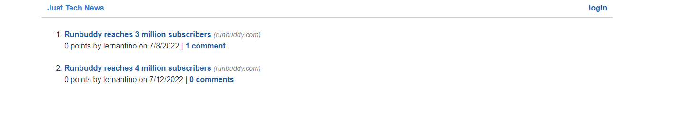

# just-tech-news

# jest-another-rpg

- Github URL: https://github.com/DanielCConlon/just-tech-news
- Heroku URL: https://young-refuge-63113.herokuapp.com/

## Table-of-Contents

- [Description](#description)
- [Usage](#usage)
- [Application](#application)

## [Description](#description)

This application is a Tech Blog site deployed to Heroku. This app follows the MVC paradigm in its architectural structure, using Handlebars.js as the templating language, Sequelize as the ORM, and the express-session npm package for authentication. In the site users can sign up for the blog, write, edit, and delete their own blog posts, read other users blog posts and comment on them, and log out of the site.

## [Usage](#table-of-contents)

Login or signup for just tech news to read others posts and create your own. As well as comment and upcote on posts.

## [Application](#table-of-contents)

